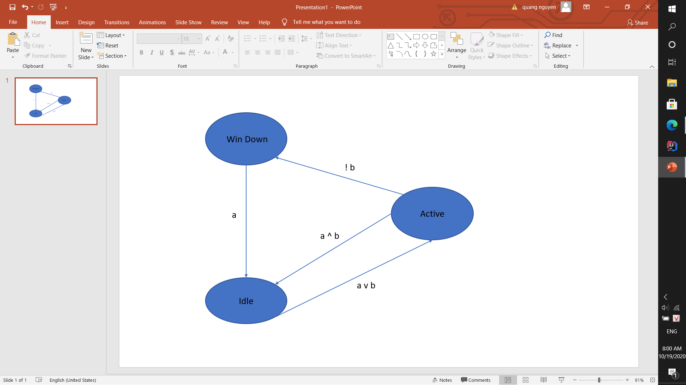

### Consider the following deterministic finite state machine:

### (a) Draw the finite state machine.

### (b) This machine does not specify which conditions cause a state to transition back to itself. However, these conditions can be derived from the existing conditions. Derive the conditions under which each state will transition back to itself.
*Điều kiện để mỗi trạng thái quay trở về chính nó: 
- WindDown : ¬a  
- Active : ¬a ^ b  
- Idle : ¬a ^ ¬b  

### (c) Find CACC tests for each transition from the Active state (including the transition from Active to Active).

* Các bộ kiểm thử CACC cho mỗi lần chuyển trạng thái từ trạng thái Active:  
- Từ Active sang Idle : a ^ b, (a,b) = (T,F), (F,T), (T,F)  
- Từ Active sang Idle : ¬b, (a,b) = (x,T), (x,F)  
- Từ Active sang Active: ¬a ^ b, (a,b) = (F,T), (T,T), (F,F)
